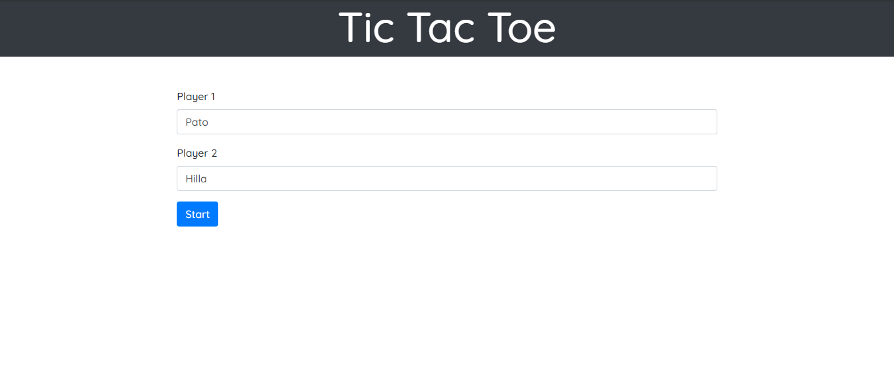
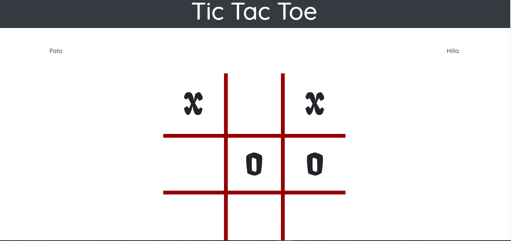
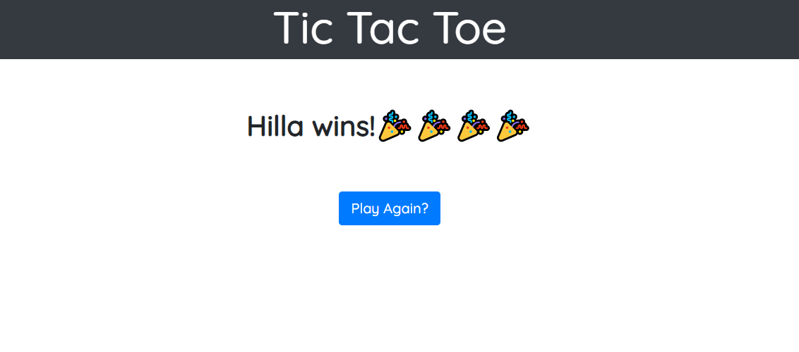
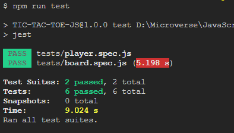

## TIC-TAC-TOE-JS
Tic tac toe game using javascript
## Screenshot

1. Home 


2. Game


3. Results



## FEATURES
- The home page shows a form to input the names of the players.
- When you start a match the first player will be selected randomly.
- One player at a time can click on the layout to select the position.
- The game finishes with a draw or a tic-tac-toe sequence.
- The match finishes with the best of three games or a draw.

## Testing Instructions
To run the test use the following command: 

```npm run test``` 



## Built With

- HTML 5 and CSS 3.
- Javascript
- Bootstrap

## Live Demo
[Live link](https://pedantic-pike-f0dd3d.netlify.app/)


## Authors

👤 **Partrick Nyatindo**

- Github: [@nyatindopatrick](https://github.com/nyatindopatrick)
- Twitter: [@nyatindopatrick](https://twitter.com/nyatindopatrick)
- Linkedin: [Patrick nyatindo](https://www.linkedin.com/in/nyatindopatrick/)
- Email: (nyatindopatrick@gmail.com)

👤 **Hillarioh Okerio**

- Github: [@hillarioh](https://github.com/hillarioh)
- Twitter: [@hillaokri](https://twitter.com/hillaokri)
- Linkedin: [Hillarioh Okerio](www.linkedin.com/in/hillaryokerio)
- Email: (okerioh@gmail.com)

## 🤝 Contributing

Contributions, issues and feature requests are welcome!

## Show your support

Give a ⭐️ if you like this project!

## 📝 License

This project is [MIT](./LICENSE) licensed.

